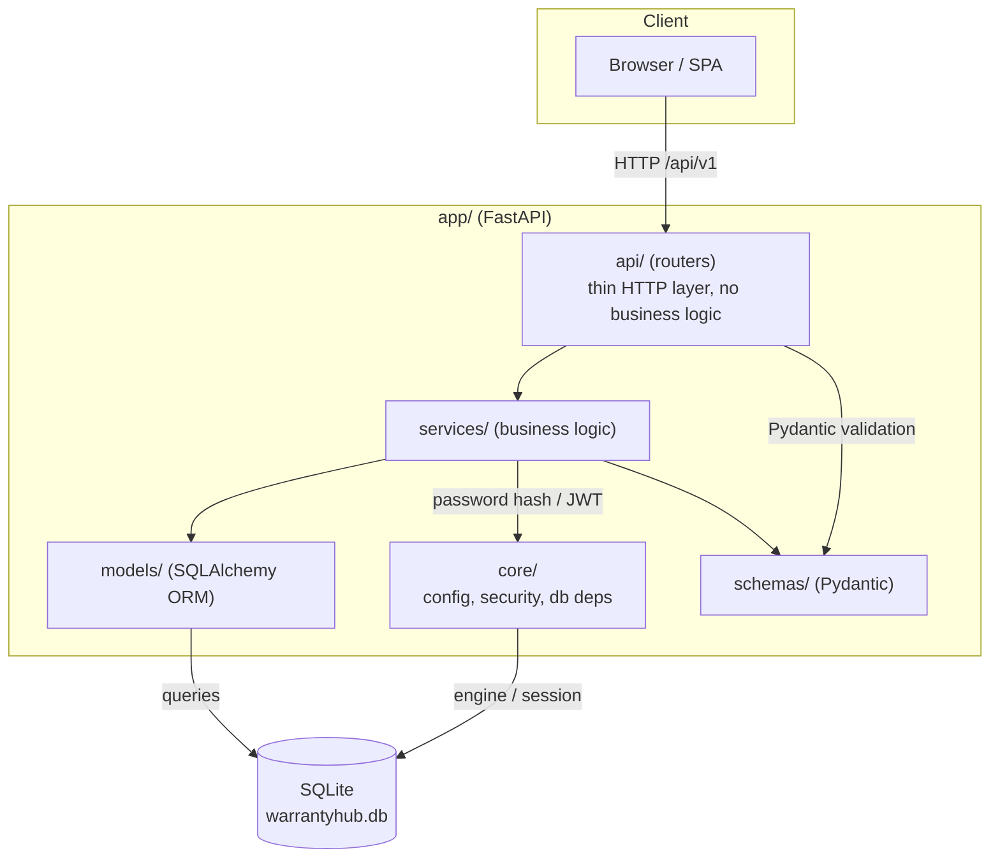

# Architecture

WarrantyHub follows a **layered architecture**: thin API routers delegate to
services, which own the business logic and talk to the ORM models through a
database session. Schemas define the API contract at the edges.

## Request flow

1. A request hits a router in `app/api/v1/endpoints/` (e.g. `POST /api/v1/auth/login`).
2. FastAPI validates the payload against a Pydantic schema (`app/schemas/`).
3. The router calls a function in `app/services/` — no business logic lives in the router.
4. The service uses `app/core/` helpers (password hashing, JWT, config) and reads/writes rows through `app/models/`.
5. The service returns data, which FastAPI serializes back through the schema.

## Test flow

`tests/` mirrors `app/`:

- `tests/test_api/v1/` — endpoint tests through `TestClient`
- `tests/test_services/` — service unit tests against an in-memory SQLite database
- `tests/test_models/` — ORM model schema tests
- `tests/test_main.py` — page/route smoke tests
